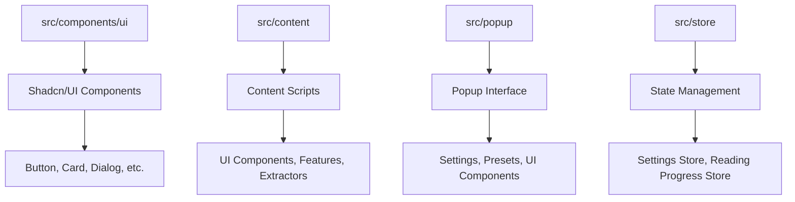

# Design Document

## Overview

第一阶段重构"架构统一"旨在建立清晰、一致、可维护的项目架构。通过统一UI组件系统、清理项目结构、优化构建配置，我们将建立一个现代化的Chrome扩展开发基础，为后续功能开发提供稳定的技术支撑。

## Steering Document Alignment

### Technical Standards (tech.md)
本设计严格遵循技术文档中定义的标准：
- **UI组件系统**: 统一使用Shadcn/UI，基于Radix UI的无障碍组件库
- **样式系统**: 采用Tailwind CSS 4，使用@theme指令定义设计令牌
- **状态管理**: 使用Zustand进行轻量级状态管理
- **构建工具**: 使用Vite进行快速构建和开发体验优化
- **包管理**: 使用pnpm作为首选包管理工具

### Project Structure (structure.md)
实现将遵循项目结构规范：
- **目录组织**: 按功能模块组织，避免深层嵌套
- **命名规范**: 组件使用PascalCase，工具函数使用camelCase
- **导入模式**: 优先使用绝对导入，保持导入顺序一致性
- **代码组织**: 单一职责原则，每个文件专注一个明确功能

## Code Reuse Analysis

### Existing Components to Leverage
- **Shadcn/UI基础组件**: 作为所有UI组件的基础，提供一致的设计语言
- **Tailwind CSS工具类**: 用于快速样式开发和响应式设计
- **TypeScript类型系统**: 提供完整的类型安全和开发体验
- **Vite构建系统**: 支持热重载、代码分割和优化构建

### Integration Points
- **Chrome Extensions API**: 与现有扩展功能集成
- **React生态系统**: 与现有React组件和状态管理集成
- **Chrome Storage API**: 与现有数据存储系统集成

## Architecture

### Modular Design Principles
- **Single File Responsibility**: 每个文件只负责一个特定功能或领域
- **Component Isolation**: 创建小型、专注的组件，避免大型单体文件
- **Service Layer Separation**: 分离数据访问、业务逻辑和表现层
- **Utility Modularity**: 将工具函数分解为专注、单一目的的模块



## Components and Interfaces

### UI组件系统 (src/components/ui/)
- **Purpose:** 提供统一的UI组件库，基于Shadcn/UI设计系统
- **Interfaces:** 标准化的组件API，支持变体、尺寸、状态等属性
- **Dependencies:** React 18, Radix UI, Tailwind CSS, class-variance-authority
- **Reuses:** Shadcn/UI基础组件，扩展自定义功能和样式

### 内容脚本架构 (src/content/)
- **Purpose:** 处理网页内容提取和阅读模式UI
- **Interfaces:** 内容提取API、UI管理API、设置同步API
- **Dependencies:** @mozilla/readability, Chrome Extensions API
- **Reuses:** 共享UI组件、状态管理、工具函数

### 弹出页面系统 (src/popup/)
- **Purpose:** 提供扩展设置和配置界面
- **Interfaces:** 设置管理API、预设配置API、用户偏好API
- **Dependencies:** React组件、状态管理、Chrome Storage
- **Reuses:** 共享UI组件、设置存储、预设管理

### 状态管理系统 (src/store/)
- **Purpose:** 管理应用状态和数据持久化
- **Interfaces:** 状态更新API、持久化API、同步API
- **Dependencies:** Zustand, Chrome Storage API
- **Reuses:** Chrome存储中间件、类型定义

## Data Models

### UI组件配置模型
```typescript
interface ComponentConfig {
  variant: 'default' | 'primary' | 'secondary' | 'outline' | 'ghost' | 'accent' | 'danger';
  size: 'xs' | 'sm' | 'default' | 'md' | 'lg' | 'icon';
  className?: string;
  disabled?: boolean;
  loading?: boolean;
}
```

### 项目结构模型
```typescript
interface ProjectStructure {
  src: {
    components: UIComponentDirectory;
    content: ContentScriptDirectory;
    popup: PopupDirectory;
    store: StateManagementDirectory;
    utils: UtilityDirectory;
    types: TypeDefinitionDirectory;
  };
  public: StaticAssetDirectory;
  dist: BuildOutputDirectory;
}
```

### 构建配置模型
```typescript
interface BuildConfig {
  entryPoints: {
    popup: string;
    background: string;
    content: string;
    contentLoader: string;
  };
  outputStructure: {
    mainFiles: string[];
    assets: string[];
    chunks: string[];
  };
}
```

## Error Handling

### Error Scenarios
1. **组件加载失败**
   - **Handling:** 提供降级组件或错误边界
   - **User Impact:** 显示友好的错误信息，保持基本功能可用

2. **构建配置错误**
   - **Handling:** 详细的错误日志和配置验证
   - **User Impact:** 清晰的错误提示和解决建议

3. **依赖冲突**
   - **Handling:** 依赖版本检查和冲突解决
   - **User Impact:** 自动修复建议或手动解决指导

4. **类型检查失败**
   - **Handling:** 严格的TypeScript配置和类型验证
   - **User Impact:** 开发时即时反馈，生产环境类型安全

## Testing Strategy

### Unit Testing
- **组件测试**: 使用React Testing Library测试UI组件
- **工具函数测试**: 使用Jest测试纯函数和工具
- **类型测试**: 使用TypeScript编译器API测试类型定义

### Integration Testing
- **组件集成测试**: 测试组件间的交互和数据流
- **API集成测试**: 测试与Chrome API的集成
- **构建集成测试**: 测试完整的构建流程

### End-to-End Testing
- **扩展功能测试**: 测试完整的扩展功能流程
- **用户场景测试**: 测试典型的用户使用场景
- **跨浏览器测试**: 测试在不同Chromium内核浏览器中的兼容性