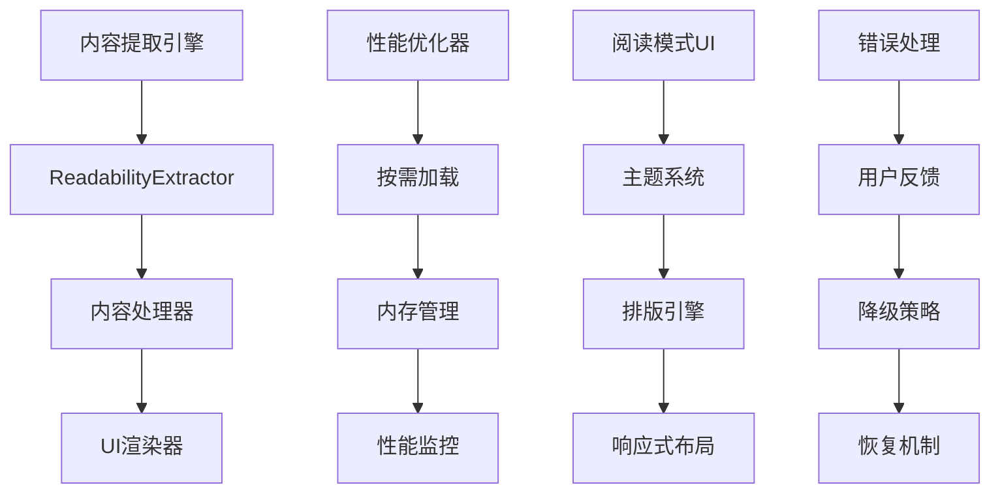

# Design Document

## Overview

第二阶段重构"核心功能优化"专注于提升Chrome阅读插件的核心功能性能、稳定性和用户体验。在第一阶段完成架构统一的基础上，我们将优化内容提取引擎、重构阅读模式UI、改进性能优化机制，确保插件能够提供更快速、更稳定、更优雅的阅读体验。

## Steering Document Alignment

### Technical Standards (tech.md)
本设计严格遵循技术文档中定义的标准：
- **性能要求**: 启动时间 < 100ms，页面影响 < 5%，内存使用 < 50MB
- **架构原则**: 模块化设计，单一职责，清晰的模块边界
- **技术栈**: React + TypeScript + Vite + Tailwind CSS + Shadcn/UI
- **状态管理**: Zustand + Chrome存储中间件

### Project Structure (structure.md)
实现将遵循项目结构规范：
- **功能模块化**: 按功能领域组织代码，如内容提取、UI管理、性能优化
- **组件复用**: 最大化共享组件的使用，减少重复代码
- **接口清晰**: 定义清晰的API接口和数据类型
- **错误处理**: 统一的错误处理和用户反馈机制

## Code Reuse Analysis

### Existing Components to Leverage
- **Shadcn/UI组件系统**: 作为所有UI组件的基础，提供一致的设计语言
- **内容提取引擎**: 基于@mozilla/readability的现有提取器
- **状态管理系统**: 现有的Zustand store和Chrome存储中间件
- **工具函数库**: 现有的DOM操作、日志管理、性能监控工具

### Integration Points
- **Chrome Extensions API**: 与现有扩展功能深度集成
- **内容脚本系统**: 与现有的内容脚本架构集成
- **存储系统**: 与现有的Chrome存储和状态管理集成
- **UI组件库**: 与现有的Shadcn/UI组件系统集成

## Architecture

### Modular Design Principles
- **单一职责**: 每个模块专注一个特定功能领域
- **高内聚低耦合**: 模块内部功能紧密相关，模块间依赖最小化
- **接口抽象**: 通过清晰的接口定义模块间的交互
- **可测试性**: 每个模块都可以独立测试和验证



## Components and Interfaces

### 内容提取引擎优化 (src/content/extractors/)
- **Purpose:** 提供快速、准确、稳定的内容提取功能
- **Interfaces:** 
  - `extractContent(url: string): Promise<ExtractedContent>`
  - `validateContent(content: string): ValidationResult`
  - `fallbackExtraction(html: string): ExtractedContent`
- **Dependencies:** @mozilla/readability, DOM API, Chrome Extensions API
- **Reuses:** 现有提取器基础，扩展错误处理和性能优化

### 阅读模式UI重构 (src/content/ui/)
- **Purpose:** 提供现代、直观、响应式的阅读界面
- **Interfaces:**
  - `ReadingModeUI(props: ReadingModeProps): JSX.Element`
  - `ThemeManager(theme: Theme): void`
  - `LayoutManager(layout: LayoutConfig): void`
- **Dependencies:** React, Shadcn/UI, Tailwind CSS
- **Reuses:** 现有UI组件，扩展主题和布局系统

### 性能优化机制 (src/content/features/)
- **Purpose:** 优化扩展性能，减少对网页性能的影响
- **Interfaces:**
  - `PerformanceMonitor.start(): void`
  - `MemoryManager.optimize(): void`
  - `LazyLoader.load(module: string): Promise<void>`
- **Dependencies:** Web Workers, Performance API, Chrome Extensions API
- **Reuses:** 现有性能工具，扩展监控和优化功能

### 错误处理系统 (src/content/error-handling/)
- **Purpose:** 提供友好的错误处理和用户反馈
- **Interfaces:**
  - `ErrorHandler.handle(error: Error): void`
  - `UserFeedback.show(message: string, type: FeedbackType): void`
  - `RecoveryManager.recover(error: Error): Promise<boolean>`
- **Dependencies:** 错误边界组件，通知系统
- **Reuses:** 现有错误处理，扩展用户反馈和恢复机制

## Data Models

### 内容提取结果模型
```typescript
interface ExtractedContent {
  title: string;
  content: string;
  textContent: string;
  length: number;
  excerpt: string;
  byline: string;
  siteName: string;
  publishedTime: string;
  readingTime: number;
  language: string;
  error?: string;
  fallbackUsed: boolean;
}
```

### 阅读模式配置模型
```typescript
interface ReadingModeConfig {
  theme: {
    name: 'light' | 'dark' | 'sepia' | 'custom';
    primaryColor: string;
    backgroundColor: string;
    textColor: string;
  };
  typography: {
    fontSize: number;
    lineHeight: number;
    fontFamily: string;
    maxWidth: number;
  };
  layout: {
    padding: number;
    margin: number;
    justifyText: boolean;
    showImages: boolean;
  };
}
```

### 性能指标模型
```typescript
interface PerformanceMetrics {
  extractionTime: number;
  renderTime: number;
  memoryUsage: number;
  cpuUsage: number;
  userInteractionTime: number;
  errorRate: number;
  successRate: number;
}
```

### 错误信息模型
```typescript
interface ErrorInfo {
  type: 'extraction' | 'rendering' | 'performance' | 'system';
  severity: 'low' | 'medium' | 'high' | 'critical';
  message: string;
  stack?: string;
  context: Record<string, any>;
  timestamp: number;
  recoverable: boolean;
}
```

## Error Handling

### Error Scenarios
1. **内容提取失败**
   - **Handling:** 尝试备用提取方法，提供手动选择选项
   - **User Impact:** 显示友好的错误信息，建议替代方案

2. **UI渲染错误**
   - **Handling:** 使用错误边界，降级到基础UI
   - **User Impact:** 保持基本功能可用，显示错误提示

3. **性能问题**
   - **Handling:** 自动性能优化，用户可选的性能设置
   - **User Impact:** 平滑的性能调整，透明的性能状态

4. **系统错误**
   - **Handling:** 优雅降级，错误日志记录，自动恢复尝试
   - **User Impact:** 最小化功能中断，清晰的错误说明

## Testing Strategy

### Unit Testing
- **组件测试**: 使用React Testing Library测试UI组件
- **工具函数测试**: 使用Jest测试内容提取和性能优化函数
- **类型测试**: 使用TypeScript编译器API测试类型定义

### Integration Testing
- **内容提取测试**: 测试完整的内容提取流程
- **UI集成测试**: 测试UI组件间的交互和数据流
- **性能测试**: 测试性能优化机制的有效性

### End-to-End Testing
- **用户场景测试**: 测试完整的阅读模式使用流程
- **性能基准测试**: 测试性能指标是否满足要求
- **错误恢复测试**: 测试错误处理和恢复机制
- **跨页面测试**: 测试在不同类型网页上的表现