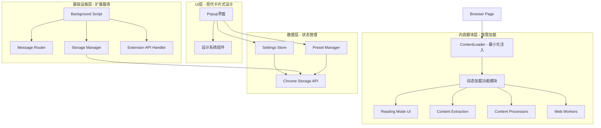

# 📖 Chrome 阅读扩展开发指南

> 🎯 **技术栈**: React 18 + TypeScript 5 + Tailwind CSS 4 + Shadcn/UI
> 📅 **最后更新**: 2024年12月
> 🚀 **版本**: v3.0 (Shadcn/UI)
> 👥 **目标读者**: 开发团队、新成员、维护者

**📚 [返回文档中心](./README.md)** | **🚀 [快速开始](./QUICK_START.md)** | **📋 [API参考](./API_REFERENCE.md)** | **🎨 [设计系统](./design-system-spec.md)**

---

## 📋 目录

1. [项目概述](#1-项目概述)
2. [核心理念与设计原则](#2-核心理念与设计原则)
3. [技术架构](#3-技术架构)
4. [开发环境](#4-开发环境)
5. [项目结构详解](#5-项目结构详解)
6. [UI 设计系统](#6-ui设计系统)
7. [核心功能模块](#7-核心功能模块)
8. [开发工作流](#8-开发工作流)
9. [编码规范](#9-编码规范)
10. [测试策略](#10-测试策略)
11. [构建与部署](#11-构建与部署)

---

## 1. 项目概述

### 1.1 项目使命

Chrome 阅读插件致力于为用户提供**简洁、优雅、本地优先**的网页阅读体验，通过智能内容提取和排版优化，让用户专注于内容本身。

### 1.2 核心价值

- **🎯 用户体验至上**: 极简设计，操作直觉
- **🔒 隐私保护**: 本地存储，无数据上传
- **⚡ 性能优先**: 按需加载，最小影响
- **🎨 个性化**: 丰富的主题和配置选项
- **🔧 可维护性**: 模块化架构，清晰代码

### 1.3 技术栈

| 技术栈                   | 版本      | 用途     | 备注 |
| ------------------------ | --------- | -------- | ---- |
| **React**                | ^18.2.0   | UI 框架  | 主要UI框架 |
| **TypeScript**           | ^5.2.2    | 类型安全 | 严格类型检查 |
| **Vite**                 | ^5.1.6    | 构建工具 | 多配置构建系统 |
| **Tailwind CSS**         | ^4.x      | CSS框架  | 使用@theme指令的现代CSS |
| **Shadcn/UI**            | latest    | 组件库   | 基于Radix UI的组件系统 |
| **Zustand**              | ^4.5.2    | 状态管理 | 轻量级状态管理 |
| **Radix UI**             | latest    | UI基础   | 无障碍的底层组件 |
| **Lucide React**         | latest    | 图标库   | 现代化图标组件 |
| **@mozilla/readability** | ^0.5.0    | 内容提取 | 智能内容提取引擎 |

| **Turndown**             | ^7.2.0    | 内容转换 | HTML转Markdown转换器 |
| **clsx**                 | ^2.1.1    | 样式工具 | 条件样式类名合并 |

---

## 2. 核心理念与设计原则

### 2.1 设计理念

#### 🎯 极简主义

- **视觉简约**: 减少视觉噪音，突出核心功能
- **交互简化**: 最少步骤完成操作
- **认知减负**: 避免复杂概念和术语

#### 🔄 渐进增强

- **基础功能**: 核心阅读功能稳定可靠
- **高级功能**: 可选配置，满足个性化需求
- **性能优化**: 按需加载，不影响基础体验

#### 🛡️ 隐私保护

- **本地优先**: 所有数据本地存储
- **最小权限**: 仅申请必要的浏览器权限
- **透明度**: 清晰说明数据使用方式

### 2.2 用户体验原则

1. **即时反馈**: 操作后立即提供视觉反馈
2. **一致性**: 统一的交互模式和视觉语言
3. **容错性**: 优雅处理错误和边界情况
4. **可访问性**: 支持键盘导航和屏幕阅读器

---

## 3. 技术架构

### 3.1 整体架构图



### 3.2 架构层级

#### 3.2.1 表现层 (Presentation Layer)

- **Popup 界面**: 现代简约卡片式设计 + React 组件
- **阅读界面**: 现代简约卡片式设计 + 动态注入的 UI 组件
- **配置界面**: 统一的卡片式设置管理界面

#### 3.2.2 业务逻辑层 (Business Logic Layer)

- **内容提取**: 基于 Readability 的智能提取
- **阅读模式**: 排版优化和主题切换
- **设置管理**: 预设和自定义配置

#### 3.2.3 数据层 (Data Layer)

- **状态管理**: Zustand + Chrome Storage
- **预设数据**: 内置主题和配置
- **用户数据**: 个人设置和阅读进度

#### 3.2.4 基础设施层 (Infrastructure Layer)

- **动态加载**: 模块化代码分割
- **消息通信**: Chrome Extension API
- **错误处理**: 统一的异常管理

---

## 4. 开发环境

### 4.1 环境要求

| 工具    | 最低版本 | 推荐版本 | 备注             |
| ------- | -------- | -------- | ---------------- |
| Node.js | 18.0.0   | 20.x.x   | LTS 版本         |
| pnpm    | 8.0.0    | 最新     | 必须使用 pnpm    |
| Chrome  | 88+      | 最新     | 支持 Manifest V3 |
| VS Code | -        | 最新     | 推荐编辑器       |

### 4.2 项目初始化

```bash
# 1. 克隆项目
git clone [repository-url]
cd chrome-plugin-reading-extension

# 2. 安装依赖
pnpm install

# 3. 启动开发环境
pnpm run dev

# 4. 构建项目
pnpm run build

# 5. 在Chrome中加载扩展
# 打开 chrome://extensions/
# 开启"开发者模式"
# 点击"加载已解压的扩展程序"
# 选择 dist 目录
```

---

## 5. 项目结构详解

### 5.1 目录结构

```
chrome-plugin-reading-extension/
├── 📁 docs/                    # 文档目录
│   ├── DEVELOPMENT_GUIDE.md    # 开发指导 (本文档)
│   ├── design-system-spec.md   # 设计系统规范
│   ├── popup-redesign-spec.md  # Popup重设计文档
│   ├── UI_DESIGN_SUMMARY.md    # UI设计统一性总结
│   └── CHANGELOG_DOCS.md       # 文档更新日志
├── 📁 src/                     # 源代码目录
│   ├── 📁 background/          # 后台脚本
│   │   └── background.ts       # 后台服务脚本
│   ├── 📁 content/             # 内容脚本
│   │   ├── 📁 components/      # 内容脚本UI组件
│   │   ├── 📁 extractors/      # 内容提取器
│   │   ├── 📁 features/        # 功能模块
│   │   ├── 📁 processors/      # 内容处理器
│   │   ├── 📁 styles/          # 样式文件
│   │   ├── 📁 ui/              # UI组件
│   │   ├── 📁 workers/         # Web Workers
│   │   ├── content.ts          # 内容脚本主文件
│   │   └── contentLoader.ts    # 最小化入口脚本
│   ├── 📁 popup/               # Popup界面
│   │   ├── 📁 components/      # Popup组件
│   │   ├── 📁 utils/           # Popup工具函数
│   │   ├── PopupMD3.tsx        # 主Popup组件
│   │   └── PopupMD3.css        # Popup样式
│   ├── 📁 design-system/       # 设计系统组件
│   │   ├── 📁 components/      # 设计系统组件
│   │   │   ├── Button.tsx      # 按钮组件
│   │   │   └── Card.tsx        # 卡片组件
│   │   ├── 📁 styles/          # 设计系统样式
│   │   ├── tokens.ts           # 设计令牌
│   │   └── index.ts            # 设计系统入口
│   ├── 📁 store/               # 状态管理
│   │   ├── settingsStore.ts    # 设置状态管理
│   │   ├── readingProgressStore.ts # 阅读进度状态
│   │   └── chromeStorageMiddleware.ts # Chrome存储中间件
│   ├── 📁 storage/             # 存储管理
│   │   ├── 📁 annotations/     # 注释存储
│   │   ├── 📁 models/          # 数据模型
│   │   ├── storage.ts          # 存储工具
│   │   └── storage-manager.ts  # 存储管理器
│   ├── 📁 ui/                  # 通用UI组件
│   │   └── 📁 components/      # 可复用组件
│   ├── 📁 types/               # 类型定义
│   │   ├── index.ts            # 主要类型定义
│   │   ├── errors.ts           # 错误类型
│   │   └── global.d.ts         # 全局类型声明
│   ├── 📁 utils/               # 工具函数
│   │   ├── dom.ts              # DOM操作工具
│   │   ├── logManager.ts       # 日志管理
│   │   └── performance.ts      # 性能监控
│   ├── 📁 constants/           # 常量定义
│   │   ├── index.ts            # 主要常量
│   │   ├── defaultSettings.ts  # 默认设置
│   │   └── options.ts          # 选项配置
│   ├── 📁 presets/             # 预设配置
│   │   ├── builtInPresets.ts   # 内置预设
│   │   └── presetManager.ts    # 预设管理器
│   └── 📁 styles/              # 全局样式
├── 📁 public/                  # 静态资源
│   ├── manifest.json           # 扩展清单
│   └── icon*.png               # 扩展图标
├── 📁 dist/                    # 构建输出
├── 📁 scripts/                 # 构建脚本
├── vite.config.ts              # 主Vite配置
├── vite.content.config.ts      # 内容脚本构建配置
├── vite.background.config.ts   # 后台脚本构建配置
├── vite.popup.config.ts        # Popup构建配置
├── package.json                # 依赖配置
├── tsconfig.json               # TypeScript配置
├── tailwind.config.js          # Tailwind配置(如使用)
└── README.md                   # 项目说明
```

### 5.2 核心目录说明

#### 5.2.1 `/src/content/` - 内容脚本

负责在网页中注入阅读功能：

- **contentLoader.ts**: 最小化入口，只包含必要功能
- **features/**: 核心功能模块
- **extractors/**: 内容提取器
- **components/**: UI 组件

#### 5.2.2 `/src/popup/` - 弹出界面

扩展的主要配置界面：

- **PopupMD3.tsx**: 主组件，采用 Shadcn/UI 组件
- **PopupMD3.css**: 样式文件，基于 Tailwind CSS
- **components/**: 子组件

#### 5.2.3 `/src/design-system/` - 设计系统

现代化的设计系统实现：

- **components/**: Shadcn/UI 组件库
  - **Button.tsx**: 基于 Radix UI 的按钮组件
  - **Card.tsx**: 现代卡片容器组件
- **styles/**: Tailwind CSS 配置和自定义样式
- **tokens.ts**: 设计令牌定义（迁移到 Tailwind 配置）
- **index.ts**: 设计系统统一导出

#### 5.2.4 `/src/store/` - 状态管理

基于 Zustand 的状态管理：

- **settingsStore.ts**: 用户设置状态管理
- **readingProgressStore.ts**: 阅读进度状态
- **chromeStorageMiddleware.ts**: Chrome 存储同步中间件

#### 5.2.5 `/src/storage/` - 存储管理

数据持久化和存储管理：

- **storage.ts**: 基础存储工具函数
- **storage-manager.ts**: 高级存储管理器
- **models/**: 数据模型定义
- **annotations/**: 注释和标记存储

#### 5.2.6 `/src/ui/` - 通用UI组件

可复用的UI组件库：

- **components/**: 通用组件
  - **CustomSlider.tsx**: 自定义滑块组件
  - **CustomSwitch.tsx**: 自定义开关组件

---

## 6. UI 设计系统

### 6.1 整体设计理念

Chrome 阅读插件采用**基于 Shadcn/UI 的现代化设计系统**，确保用户在所有界面中获得一致的视觉体验：

#### 🎴 核心设计特征

- **组件化设计**: 基于 Radix UI 的高质量组件库
- **一致性**: 统一的设计令牌和视觉语言
- **无障碍**: 完整的 a11y 支持和键盘导航
- **主题系统**: 支持明暗主题的动态切换
- **现代美观**: 简洁优雅的视觉设计

#### 🔄 界面统一性

| 界面组件         | 设计风格       | 应用场景                       |
| ---------------- | -------------- | ------------------------------ |
| **Popup 界面**   | Shadcn/UI 组件 | 扩展配置、预设选择、高级设置   |
| **阅读模式界面** | Shadcn/UI 组件 | 文章内容展示、工具栏、设置面板 |
| **浮动按钮**     | Button 组件    | 阅读模式切换入口               |
| **设置面板**     | Card 组件      | 实时设置调整                   |

#### 🎨 设计系统要素

```typescript
// Tailwind CSS 配置
export default {
  theme: {
    extend: {
      colors: {
        background: "hsl(var(--background))",
        foreground: "hsl(var(--foreground))",
        primary: {
          DEFAULT: "hsl(var(--primary))",
          foreground: "hsl(var(--primary-foreground))",
        },
        card: {
          DEFAULT: "hsl(var(--card))",
          foreground: "hsl(var(--card-foreground))",
        },
      },
    },
  },
}

// Shadcn/UI 组件使用示例
import { Card, CardContent } from '@/components/ui/card';
import { Button } from '@/components/ui/button';

<Card>
  <CardContent>
    <Button variant="default">操作按钮</Button>
  </CardContent>
</Card>
    135deg,
    rgba(99, 102, 241, 0.08) 0%,
    rgba(168, 85, 247, 0.05) 100%
  );
  border: 1px solid rgba(99, 102, 241, 0.15);
  backdrop-filter: blur(8px);
}
```

详细的设计规范请参考 [`docs/design-system-spec.md`](design-system-spec.md)

---

## 7. 核心功能模块

### 7.1 内容提取系统

采用基于 Readability.js 的智能提取架构：

```typescript
interface IExtractor {
  extract(document: Document): Promise<ExtractedContent>;
  validate(content: ExtractedContent): boolean;
  cleanup(content: ExtractedContent): ExtractedContent;
}

class ExtractorFactory {
  static create(type: ExtractorType): IExtractor {
    switch (type) {
      case "readability":
        return new ReadabilityExtractor();
      case "custom":
        return new CustomExtractor();
      default:
        throw new Error("Unknown extractor type");
    }
  }
}
```

### 7.2 阅读模式系统

采用**现代简约卡片式设计**，为用户提供沉浸式的阅读体验：

#### 功能特性

- **卡片式内容展示**: 文章内容以卡片形式呈现，背景毛玻璃效果
- **浮动工具栏**: 卡片式工具栏，支持实时设置调整
- **主题切换**: 支持亮色、暗色、护眼等主题，卡片样式自适应
- **排版优化**: 字体、行距、段落间距调整，实时预览
- **代码高亮**: 自动识别和高亮代码块，使用卡片容器
- **图片处理**: 图片放大、延迟加载，圆角卡片样式

### 7.3 设置管理系统

最新的配置界面采用**预设优先**的设计：

```typescript
// 预设与详细设置的智能交互
class PresetManager {
  async applyPreset(presetId: string) {
    const preset = this.getPreset(presetId);
    await this.updateSettings(preset.settings);
    this.setActivePreset(presetId);
  }

  detectCustomization(newSettings: Partial<UserSettings>) {
    const currentPreset = this.getActivePreset();
    const isMatch = this.compareSettings(currentPreset.settings, newSettings);
    return !isMatch;
  }
}
```

---

## 8. 开发工作流

### 8.1 Git 工作流

#### 8.1.1 分支策略

```
main            # 主分支，生产就绪代码
├── develop     # 开发分支，集成测试
├── feature/*   # 功能分支
├── bugfix/*    # 缺陷修复分支
└── hotfix/*    # 紧急修复分支
```

#### 8.1.2 提交规范

使用[Conventional Commits](https://www.conventionalcommits.org/)规范：

```bash
# 功能开发
git commit -m "feat(popup): add preset status indicator"

# 缺陷修复
git commit -m "fix(content): resolve extraction error on dynamic pages"

# 文档更新
git commit -m "docs: update development guide"
```

### 8.2 开发流程

1. **需求分析** → 创建功能分支
2. **设计阶段** → 编写技术设计文档
3. **开发实现** → 实时构建和测试
4. **测试验证** → 运行测试套件
5. **代码评审** → Pull Request 流程
6. **集成部署** → 合并到 develop 分支

---

## 9. 编码规范

### 9.1 TypeScript 规范

```typescript
// ✅ 推荐：明确的接口定义
interface UserSettings {
  fontSize: number;
  lineHeight: number;
  fontFamily: string;
}

// ✅ 推荐：泛型使用
interface ApiResponse<T> {
  data: T;
  status: 'success' | 'error';
  message?: string;
}

// ❌ 避免：any类型
const handleData = (data: any) => { ... }

// ✅ 推荐：具体类型
const handleData = (data: ExtractedContent) => { ... }
```

### 9.2 React 组件规范

```typescript
// ✅ 推荐的组件结构
interface PresetSelectorProps {
  presets: Preset[];
  selectedId: string;
  onSelect: (id: string) => void;
  className?: string;
}

export const PresetSelector: React.FC<PresetSelectorProps> = ({
  presets,
  selectedId,
  onSelect,
  className,
}) => {
  // 1. Hooks
  const [isLoading, setIsLoading] = useState(false);

  // 2. 计算属性
  const selectedPreset = useMemo(
    () => presets.find((p) => p.id === selectedId),
    [presets, selectedId]
  );

  // 3. 事件处理
  const handleSelect = useCallback(
    (id: string) => {
      setIsLoading(true);
      onSelect(id);
      setIsLoading(false);
    },
    [onSelect]
  );

  // 4. 渲染
  return <div className={cn("preset-selector", className)}>{/* JSX */}</div>;
};
```

---

## 10. 测试策略

### 10.1 测试层级

- **单元测试**: 工具函数、组件测试
- **集成测试**: API 集成、模块交互
- **端到端测试**: 浏览器自动化、扩展安装
- **用户接受测试**: 真实用户场景、可用性测试

### 10.2 测试工具

- **Jest**: 单元测试框架
- **React Testing Library**: 组件测试
- **Playwright**: 端到端测试
- **Chrome Extension Testing**: 扩展专用测试

---

## 11. 构建与部署

### 11.1 构建配置

项目采用多配置文件架构：

```bash
# 构建脚本
pnpm run build:content   # 内容脚本
pnpm run build:background # 后台脚本
pnpm run build:popup     # 弹出页面
pnpm run build           # 全量构建
```

### 11.2 发布流程

1. **构建生产版本**
2. **创建发布包**
3. **上传到 Chrome Web Store**
4. **发布新版本**

### 11.3 发布检查清单

- [ ] 所有测试通过
- [ ] 代码检查通过
- [ ] 功能验证完成
- [ ] 文档更新完成
- [ ] 版本号更新

---

## 12. 构建系统详解

### 12.1 多配置构建策略

项目采用多个 Vite 配置文件实现不同模块的独立构建，这是 Chrome 扩展开发的最佳实践：

#### 配置文件说明

| 配置文件 | 用途 | 输出格式 | 特殊配置 |
|---------|------|----------|----------|
| `vite.config.ts` | 开发服务器主配置 | ESM | 开发时热重载 |
| `vite.content.config.ts` | 内容脚本构建 | IIFE | 内联动态导入 |
| `vite.background.config.ts` | 后台脚本构建 | IIFE | 外部化 chrome API |
| `vite.popup.config.ts` | Popup 界面构建 | ESM | React 组件优化 |

#### 构建命令详解

```bash
# 分模块构建 - 推荐用于开发调试
pnpm run build:content     # 仅构建内容脚本
pnpm run build:background  # 仅构建后台脚本
pnpm run build:popup       # 仅构建 Popup 界面

# 完整构建 - 用于生产发布
pnpm run build            # 构建所有模块 + 复制静态资源
```

### 12.2 代码分割策略

#### 内容脚本优化

内容脚本采用**最小化注入 + 按需加载**策略：

```javascript
// vite.content.config.ts 中的分割策略
manualChunks: (id: string) => {
  // 核心模块 - 最小化初始加载
  if (id.includes('src/content/contentLoader')) {
    return 'core';
  }

  // 功能模块 - 按需加载
  if (id.includes('src/content/features/readingMode')) {
    return 'feature-reader-mode';
  }

  if (id.includes('src/content/features/contentExtraction')) {
    return 'feature-content-extraction';
  }

  // 第三方依赖
  if (id.includes('node_modules/@mozilla/readability')) {
    return 'vendor-readability';
  }
}
```

#### 输出目录结构

```
dist/
├── src/
│   ├── background/
│   │   └── background.js          # 后台脚本
│   ├── contentLoader/
│   │   └── contentLoader.js       # 内容脚本入口
│   └── content/
│       └── chunks/                # 按需加载的功能模块
│           ├── core-[hash].js
│           ├── feature-reader-mode-[hash].js
│           └── vendor-readability-[hash].js
├── assets/                        # 静态资源
├── index.html                     # Popup 页面
└── manifest.json                  # 扩展清单
```

### 12.3 构建优化配置

#### 性能优化

```javascript
// 通用优化配置
build: {
  target: 'esnext',              // 现代浏览器目标
  minify: 'terser',              // 代码压缩
  sourcemap: false,              # 生产环境禁用 source map
  assetsInlineLimit: 4096,       # 4KB 以下文件内联为 base64
  reportCompressedSize: false,   # 禁用压缩大小报告提升构建速度

  terserOptions: {
    compress: {
      drop_console: false,       # 保留 console.log 用于调试
      drop_debugger: true        # 移除 debugger 语句
    }
  }
}
```

#### Chrome 扩展特定优化

```javascript
rollupOptions: {
  external: ['chrome'],          # 外部化 Chrome API
  output: {
    globals: {
      chrome: 'chrome'           # Chrome API 全局变量映射
    }
  }
}
```

### 12.4 开发环境配置

#### 热重载支持

开发环境支持文件变更自动重新构建：

```bash
# 监听模式 - 文件变更时自动重新构建
pnpm run watch

# 开发服务器 - Popup 界面热重载
pnpm run dev
```

#### 调试配置

```javascript
// 开发环境特定配置
server: {
  port: 3000,
  open: false,                   # 不自动打开浏览器
  cors: true                     # 启用 CORS 支持
},

// 开发环境启用 source map
sourcemap: process.env.NODE_ENV !== 'production'
```

### 12.5 构建流程自动化

#### 完整构建流程

```bash
# package.json 中的构建脚本
"build": "pnpm run build:content && pnpm run build:background && pnpm run build:popup && cp -r public/* dist/ && pnpm run cleanup"
```

构建流程说明：
1. **构建内容脚本** - 生成最小化入口和功能模块
2. **构建后台脚本** - 生成服务工作者脚本
3. **构建 Popup 界面** - 生成 React 应用
4. **复制静态资源** - 复制 manifest.json 和图标
5. **清理临时文件** - 移除构建过程中的临时文件

#### 构建验证

构建完成后的验证检查：

```bash
# 检查必要文件是否存在
ls dist/manifest.json
ls dist/src/background/background.js
ls dist/src/contentLoader/contentLoader.js
ls dist/index.html

# 检查文件大小（内容脚本应保持最小）
du -h dist/src/contentLoader/contentLoader.js  # 应 < 50KB
```

---

## 结语

这份开发指导手册是 Chrome 阅读插件项目的核心文档，为团队提供全方位的开发指导。它将随着项目的发展不断完善和更新。

### 📚 后续学习资源

- [Chrome Extensions Documentation](https://developer.chrome.com/docs/extensions/)
- [React Documentation](https://react.dev/)
- [TypeScript Handbook](https://www.typescriptlang.org/docs/)

### 🤝 贡献指南

欢迎团队成员对这份文档提出改进建议，通过 Pull Request 方式更新文档内容。

---

**文档版本**: v1.0  
**最后更新**: 2024 年 12 月  
**维护团队**: Chrome 阅读插件开发组
