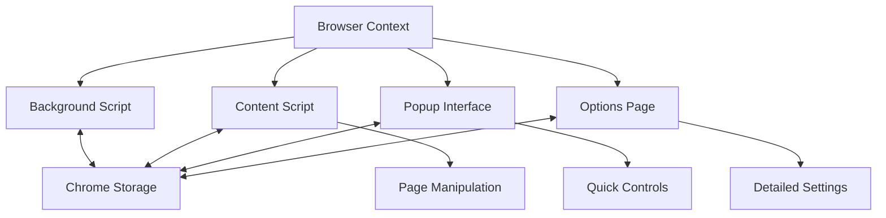
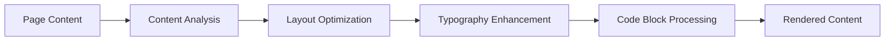
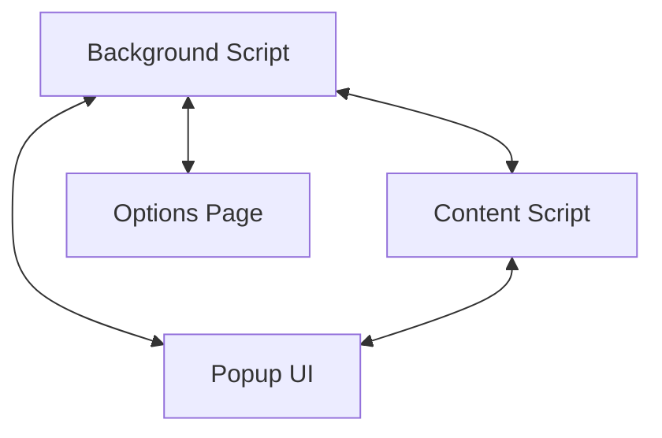

# System Patterns: AI Reading Extension

## Architecture Overview

The extension follows a standard Chrome extension architecture with specialized components:

## Key Design Patterns

### 1. Component-Based Architecture

- React components for UI elements
- Modular approach to feature implementation
- Separation of concerns between UI and logic

### 2. State Management Pattern

- Zustand store for global state
- State slices for different functional areas
- Reactive state updates across components

### 3. Content Processing Pipeline

### 4. Extension Communication Model

### 5. Storage Strategy

- Chrome synchronized storage for user preferences
- Local storage for temporary data
- Settings versioning for migration

## Component Relationships

### Content Script Components

- **Content Analyzer**: Examines page structure
- **Layout Optimizer**: Adjusts spacing and formatting
- **Typography Manager**: Handles text presentation
- **Code Highlighter**: Processes code blocks
- **Media Handler**: Manages images and multimedia

### Popup Components

- **Mode Toggler**: Activates reading mode
- **Quick Settings**: Frequently used options
- **Status Display**: Shows current state

### Options Page Components

- **Settings Manager**: Full configuration controls
- **Theme Customizer**: Visual appearance settings
- **Profile Manager**: Save/load preferences

## Technical Decisions

### 1. React + TypeScript

- Type safety for complex state management
- Component reusability across extension parts
- Better maintainability for future extensions

### 2. Vite Build System

- Fast development experience
- Efficient bundling for multiple extension components
- Optimized production builds

### 3. Tailwind CSS

- Consistent styling across components
- Responsive design for different viewing contexts
- Reduced CSS overhead

### 4. Headless UI

- Accessible UI components
- Customizable appearance
- Lightweight implementation

### 5. State Management with Zustand

- Simpler than Redux for extension needs
- Persistent state with minimal boilerplate
- Excellent TypeScript integration
